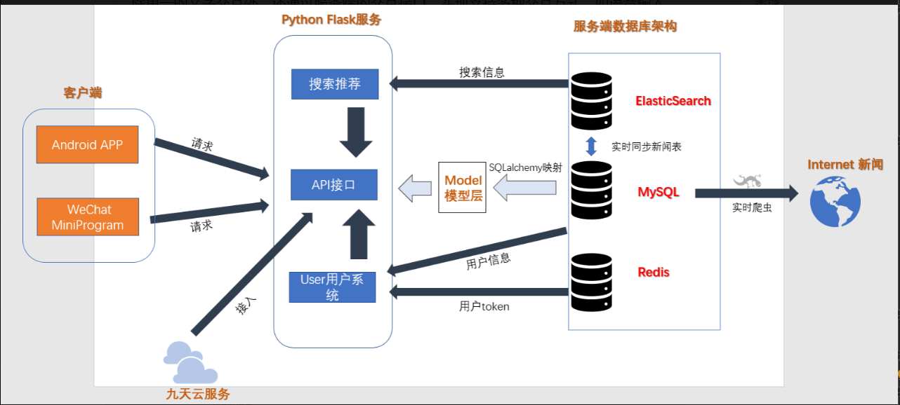

# 2022软件杯--云视--项目后端

## 项目结构

  ### 模块

  1. 新闻推荐、语音交互及管理员服务端
      - 与用户客户端交互

          负责联系服务端和用户客户端，处理用户信息，向用户客户端推送新闻，并提供用户交互的接口。

          服务端通过特定算法，智能地向用户个性化地推荐其可能感兴趣的新闻，并支持用户主动搜索新闻。同时，来自用户客户端的交互行为会经过服务端代理请求第三方API，以将交互行为转化为有意义的操作或信息（如将语音转化为文字）。
      - 与管理员客户端交互

          提供管理员界面后端服务，供管理员前端方便地查看服务器状态并配置服务器。
  1. 新闻实时爬取服务

      由于新闻具有实时性，所以本项目提供实时爬取最新新闻的功能。实时爬取服务将新闻从互联网上无版权争议地爬取到本项目的服务器中，加以整理并存储至数据库，使得用户可获取到最新的新闻。
  1. 用户客户端

      用户客户端直接与用户进行交互，将用户信息发送至服务端，并从服务端获取数据，主要是要推荐的新闻。由于本项目面向的是视力障碍人士，故客户端的操作方式较简便；并且除单一的文字交互外，还通过服务端的交互接口，实现支持多种交互方式，如语音输入、朗读、图片转文字等。
  1. 管理员前端

      用网页的形式，将服务器的状态和与项目相关的数据展示出来，供管理员查看和配置

  ### 架构

  

  ### 实现细节
    - 开启数据库服务

        在数据库中保存用户信息、已有的新闻，以及用户的浏览记录以根据用户喜好进行个性化推荐
    - 开启服务端进程，监听客户端请求。
        - 当用户客户端请求新闻推荐时，服务端查询数据库，根据用户信息、浏览历史及其他用户的喜好特点进行智能推荐，返回新闻数据。
        - 当用户请求特殊交互方式时，服务端调用第三方API，将结果整理返回给客户端，游客户端呈现给用户。
        - 当管理员前端发起请求时，服务端返回前端页面，并由前端页面请求服务器数据。服务端返回要展示的数据，由前端页面渲染并呈现给管理员。
        - 若管理员修改数据，由前端页面请求后端执行指令，判断合法后执行修改操作，将服务器数据或设置修改。
    - 开启实时爬取服务进程

        将爬取得到的新闻整理，归类，存放至数据库。当用户下次请求新闻时，新爬取的新闻就有可能被推荐给用户。